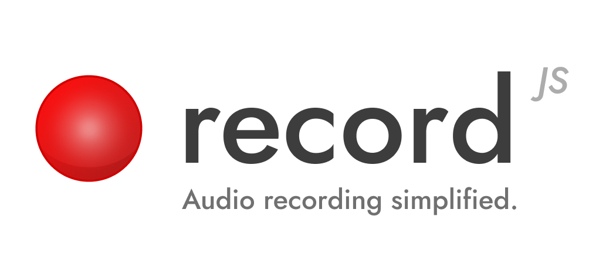

<div align="center">
  
</div>

---

RecordJS (or record.js) is a zero-dependency wrapper around the [Web Audio API](https://developer.mozilla.org/en-US/docs/Web/API/Web_Audio_API) that makes recording audio on the web _super easy_. 

Record fully supports ESM, CJS & TypeScript, and can even be imported with one file (`record.js`).

Instead of following  [super long tutorials](https://web.dev/media-recording-audio) on how to record on the web, just use RecordJS:

```typescript
import { AudioRecorder } from 'record.js';

const recorder = new AudioRecorder();

await recorder.start();

// A little while later...

const data = await recorder.stop();

// Yay we have our recorded data as a blob object!
console.log(data);

```

Wasn't that easy?

## Installing

Getting up and running with Record is as simple as:

```bash
$ npm install record.js
```

Or, if you use [Yarn](https://yarnpkg.com):

```bash
$ yarn add record.js
```

### Dealing with Bundlers

Seeing the new Audio Worklets API loads JavaScript files asynchronously for some dumb reason, there's a chance you may need to manually specify a worklets directory in order for Record to function correctly. By default, Record will just look in the relative path for worklets. 

However, in the case in which you're using a bundler like [Vite](https://vitejs.dev), you'll probably need to update the [`assetsInclude` config option](https://vitejs.dev/config/shared-options.html#assetsinclude) to contain Record's worklets:

```typescript
{
  assetsInclude: ['./node_modules/record.js/dist/worklets/cjs'],
}
```

Then, you can point Record to this directory:

```typescript
const recorder = new AudioRecorder({
  workletPath: '/node_modules/record.js/dist/worklets/cjs' 
});
```

Sucks, I know, but it's necessary.

## Motivation

In case you aren't sold on why this is needed, let me be frank: recording audio on the web is _much_ harder than it should be. Just to monitor something as fundamental as input volume requires [_so much code_](https://stackoverflow.com/a/62732195). My God.

A little while ago (as in 5+ years ago), the Google Chrome team announced support for [Audio Worklets](https://developer.chrome.com/blog/audio-worklet/), a new way to manage web audio that was built to replace the [ScriptProcessorNode](https://developer.mozilla.org/en-US/docs/Web/API/ScriptProcessorNode). RecordJS uses Audio Worklets out-of-the-box, whereas older, similar libraries still rely mostly on ScriptProcessorNodes.  

### An Important Note

Unlike Record's sister library [PushJS](https://github.com/Nickersoft/push.js), Record was created to provide a more intuitive way to use the Web Audio API, _not_ provide backwards-compatibility for it. There is no guarantee RecordJS will work on older browsers, _but_ if you need to fill the gap in some way, I encourage you to use Google's [audio worklet polyfill](https://github.com/GoogleChromeLabs/audioworklet-polyfill) for the time being.

## Finding & Using Devices

Even though calling `recorder.start()` will automatically create a stream for you using the default device, there's a chance you may want to use a different device if you have multiple devices plugged in. Fortunately, with Record using one of these devices is super easy:

```typescript
import { AudioRecorder } from 'recorder.js';

const deviceList = await AudioRecorder.listDevices();

const recorder = new AudioRecorder({ 
  deviceId: deviceList[0].id 
});

await recorder.start();
```

## Monitoring Volume & Other Events

Record supports a number of basic event listeners, including listening for volume changes. Instead of going through the extremely long code linked to earlier, you can monitor input volume using:

```typescript
recorder.on('volumechange', ({ volume }) => {
  console.log("Input volume is " + volume);
})
```

Record also supports a few other event listeners, such as `stop` and `start`.

## Future Plans

This library came out of my own needs for web audio, so it will be definitely maintained for the time being. I'd like to see it eventually grow to encapsulate other kinds of web media management, such as video and screen recording as well.

## Similar Projects

- **[RecordRTC](https://github.com/muaz-khan/RecordRTC)** (last published 2+ years ago)
- **[recorderjs](https://github.com/mattdiamond/Recorderjs)** (last published 8+ years ago)